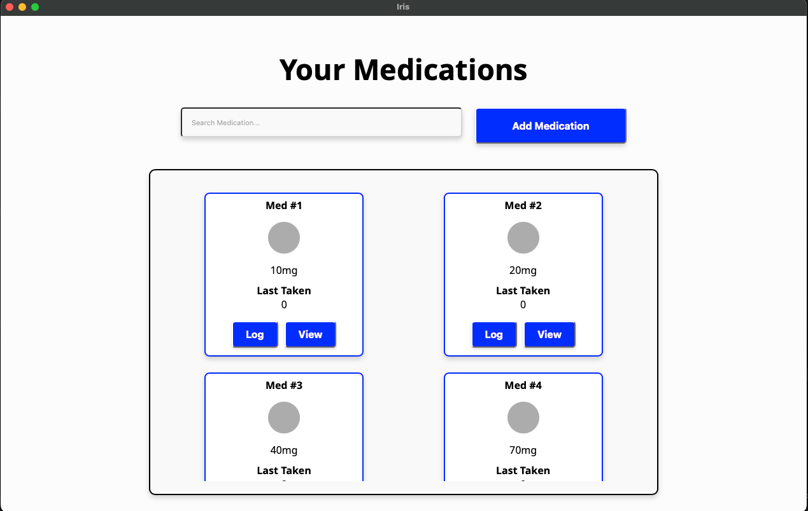
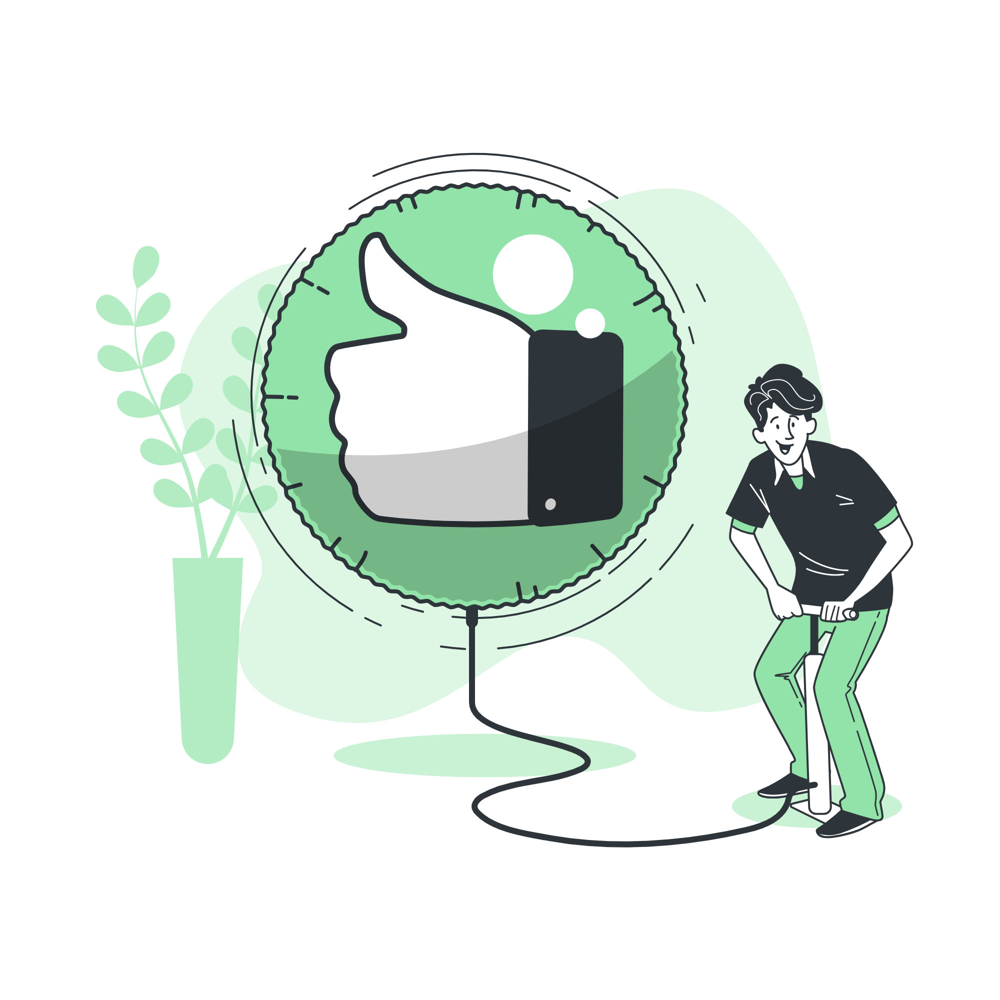

# 2024 Summer Sendoff

<!-- markdownlint-disable MD026 -->
<!-- ^ disabled no-trailing-punctuation -->

<!-- truncate -->

## What Happened?

Throughout this summer our members went through many achievements and
accomplishments. To begin, our members were able to get accepted into the
Learning Aligned Employment Program (LAEP) and the Summer Undergraduate Research
 Program fellowship (SURP). Read more about it in our previous [news update!](https://ojosproject.org/news/surp-fellowship-2024/) 

The Ojos Project then worked remotely through the use of discord and other
telenetwork software. With our group of 8 members meeting weekly, we push
forward our goal on completing the Iris Software and Palliaview device
prototypes. Additionally, it was an opportunity for our members to develop
necessary career and research skills in there respective majors.

After, an intial set back in regards for funding for the group, Ojos project
spent the next 12 weeks conducting research, designing,  and familiarizing with
the different technical skills and niches of field.

Also, our Research team began to look into a international completion known as
the Computer Human Interaction (CHI) Conference as a viable goal for the
Ojos Project and the requirements entailed.

In addition, some of our members began the hand-off of the Undergraduate
Research Lab (URL). Prepping to recruit and serve as advisors and resources
for new Undergraduate research teams.

Below are more details about each of our teams indivual goals and updates.

## Iris Development

[Iris User Interface](../../static/images/irisuserinterface.png)

The developers finally began the very messy process of programming. We decided
to take up the challenge and learn various tools that we're not too familiar
with, such as the Rust programming language and NextJS. As well as learning
these tools, we also adapted a collaborative workflow with GitHub and started
using [pull requests](https://github.com/ojosproject/iris/pulls/) to better keep
track of our process on specific features.

.png)

As of now, there isn't too much to show, [as we're still actively working on
Iris](https://github.com/ojosproject/iris/commits/main/?since=2024-06-13&until=2024-09-15).
As soon as we have more to show, we will immediately display it here.

Until then, the developers are working on a more technical news post to show
what we've been doing during the summer, which will be released soon. Stay
tuned!

## Engineering News

This summer, Engineers had  goals of:

- [] Fabricate our prototype Palliaview V0.2 after our intial modeling for
deployment.

- [] Begin certification and the skill traing of many of the members including
  CAD, Additive Manufacturing, and electrical design.
- [] Create and [standardize design report](https://github.com/ojosproject/website/pull/45)
    for Palliaview.

Fortunately,  we were able to achieve most of our goals or make some
advancement on every goal. With some goals still being finished this fall
quarter.

To begin, our team created a 10 week outline on what we should do. In order to
make sure we were set on pace to complete our goals. However,  we had to adjust
to compensate for summer obligations and personal matters that came up.

These changes include postponing and working ascrynchously. And even adjust
timelines to focus on different aspect of our Research.

For example conducting more research and improving reference models for
our Research while we awaited for parts. Beyond this we began to look for public
avavible design to implement as out mounting system for this iteration of
Palliaview.

We have goals of completing our protoype for V0.2 by the end of this quarter to 
begining our V0.3 of the process. Beyond this,our deployment of the project. 

## Research News

To further our understanding of hospice care and its relationship with
technologies, we aim to gather futher insights from individuals with experience
working in hospice settings. This includes nurses, caregivers, social workers,
and volunteers who provide care. By engaging these groups, we seek to explore
their perspectives on how various technologies affect the delivery of care,
communication with patients and families, and overall workflow efficiency.
By collaborating with those who have firsthand experience in hospice care,
we hope to uncover valuable insights into how technology can better serve the
needs of both caregivers and patients in these emotionally complex environments.

In addition, we have made some have made some acheivements already; such as:

- Outreach potential interviewee like healtchare professionals and caregivers
- standardize the research methods

## Some Future Goals

<!-- we need to write some of the news about goals we have for this fall and year
-[] specifically about the CHI competition and the taking over the URL -->

:::note

These goals may just change as the quarter begins and we get things moving. As
a baseline, here are some things we have in mind:

:::

- General
  - Finish IRB Training and Engineering Ceritifications
  - Finishing UROP symposium proposal
  - begin chating course for the CHI Competition.

- Engineering
  - With our preliminary designs being updated and nearly completed, the focus
  is producing and evaluation our Palliaviw V0.2.
  - Begin a deployment in the end of Fall, or beginning of winter quarter.
  - Begin and compact our initial design in the V0.3 and begin incorporating
  more accessibility technology  and biometric data
  - Conduct certifications of several our members to expand skillset

- Developers
  - Create a beta version by early fall
  - Create a tool to easily install and test Iris on Linux

## Thank you!

As the Ojos Project moves forward, we would like to acknoweledge all the
contributions many of our memebers made. In addition, we are grateful the
resources many of the supporters of our goal. Please stay tuned as we start our fall research again.

<a href="https://storyset.com/travel">Travel illustrations by Storyset</a>